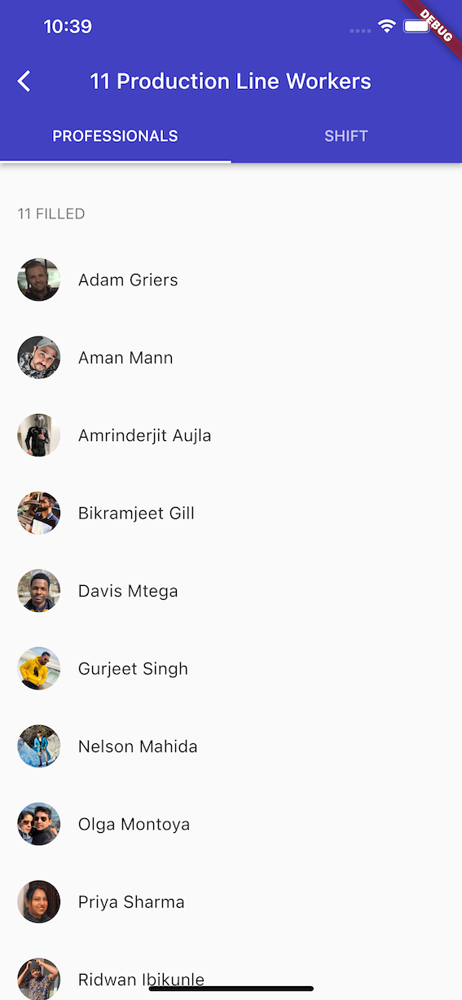

# Exercise Mobile

## Getting Started 🚀

This project contains 3 flavors:

- development
- staging
- production

To run the desired flavor either use the launch configuration in VSCode/Android Studio or use the following commands:

```sh
# Development
$ flutter run --flavor development --target lib/main_development.dart

# Staging
$ flutter run --flavor staging --target lib/main_staging.dart

# Production
$ flutter run --flavor production --target lib/main_production.dart
```

_Exercise Mobile works on iOS, Android, and Web._

---

## Tasks 📝

In our business, we have shifts and a set of professionals assigned to each shift. You are tasked with building a mobile application using Flutter that displays two screens: **Shifts** and **Shift Details**.

To fetch data use [/shifts/](https://099f998e-8348-4d04-83b6-891462df8f52.mock.pstmn.io/shifts) endpoint (https://099f998e-8348-4d04-83b6-891462df8f52.mock.pstmn.io/shifts).
API docs for the endpoint is available [here](https://documenter.getpostman.com/view/18371161/UVJfhuPi).

The Shifts screen should display a list of all available shifts, grouped by date:


Clicking on any Shift will open the ShiftDetails screen where Professionals assigned to that Shift and Shift Details are displayed.

 

Try to follow the designs as closely as possible. Please make sure to handle edge cases.

### Optional Challenge 🤩
* include automated tests
* host the Flutter Web application on a free hosting service somewhere and send us a link to it

---

## Submit the solution ✅

Please upload your solution to a public Github/Gitlab/Bitbucket repository (only one). If your solution requires any specific setup please update this `README.md` with those requirements. Once you have completed the Tasks, please send us the link to that public repository.

Please reach out to us if you have any questions or run into any issues.
All the best, and we look forward to receiving your solutions!
